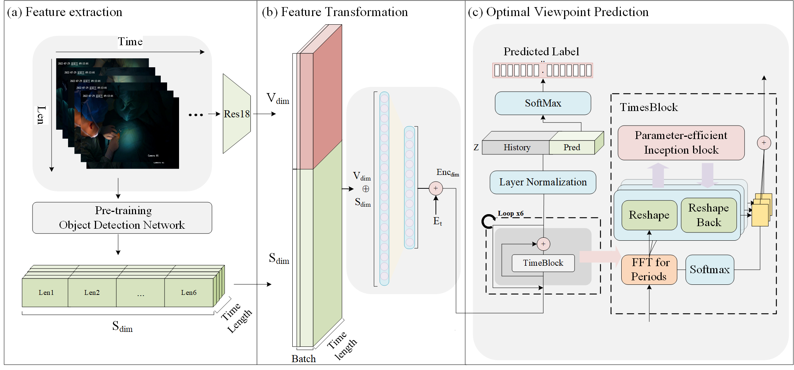

# SurgicalCamSwitch

**SurgicalCamSwitch** is a deep learning–based video analysis and time-series prediction framework designed for **optimal surgical camera selection** in open surgery environments.  
It integrates multiple architectures including **Transformer**, **VAE**, and **CNN** models to perform **multi-task learning**, **anomaly detection**, and **visual analytics** of multi-view surgical videos.

---

🎉 News

It gives me great pleasure to inform you that our manuscript “SurgicalCamSwitch: A Deep Learning Framework for Optimal Surgical Camera Selection in Open Surgery Environments” has been accepted for publication in the IEEE Journal of Biomedical and Health Informatics (J-BHI).

We would like to express our sincere gratitude to all contributors and reviewers for their valuable support!

## 🖼️ System Overview

<p align="center">
  
</p>

**Figure 1.** Overall architecture of the *SurgicalCamSwitch* framework.  
The system captures synchronized multi-view surgical videos, extracts visual and temporal features, and predicts the optimal viewpoint through a transformer-based temporal modeling network.

---

## 🛠️ environment configs

```bash
# 创建环境
conda create -n surgicalcam python=3.10
conda activate surgicalcam

# 安装依赖
pip install torch torchvision torchaudio
pip install numpy pandas scikit-learn matplotlib tqdm
pip install git-filter-repo
```

---

## 📚 cite

coming soon

---

